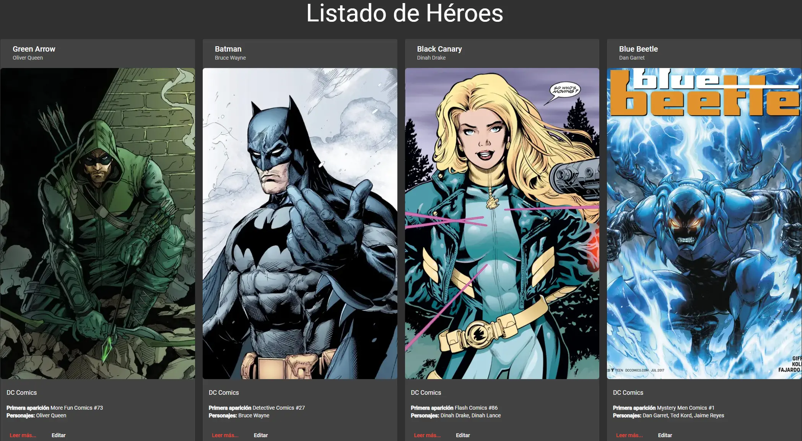

[](https://heroes-appmv.netlify.app/)
# HeroesApp

This *HeroesApp* project was made with the purpose of putting into practice basic concepts in web development with Angular Framework.
Topics:
* Angular Authentication: Using Route Guards
* Lazyload modules
* CRUD API REST
* Angular Material
* Reactive Forms
The database is stored in [Google Realtime Database](https://firebase.google.com/docs/database).

This project was generated with [Angular CLI](https://github.com/angular/angular-cli) version 12.1.1.

## Development server

```sh
  ng serve
```
Run `ng serve` for a dev server. Navigate to `http://localhost:4200/`. The app will automatically reload if you change any of the source files.

## Building and Running for Production

1. Install the Angular CLI

   ```sh
   npm install -g @angular/cli
   ```
2. Install dependencies

    ```sh   
   npm install
    ```

3. Run ng build

    ```sh   
   ng build
    ```

The build artifacts will be stored in the `dist/` directory.

## Disclamer 
This project does not have a robust backend, do not enter real information when creating the user account.
